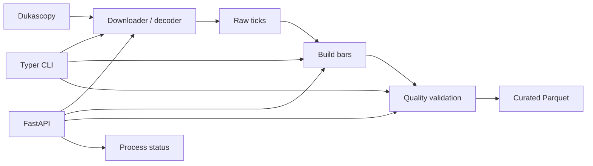

# Forex Data Downloader — Data Engineering + FastAPI

Aplicación en Python para **adquirir, transformar, validar y servir datos de mercado** provenientes de Dukascopy. El proyecto trabaja con ticks L1, reconstrucción de barras, validaciones de calidad y persistencia en formato Parquet.

Además de la CLI, incluye una **API REST con FastAPI/Pydantic** para ejecutar y supervisar el pipeline de datos.

> Proyecto de ingeniería de datos para investigación y backtesting. No constituye un sistema de inversión listo para producción ni una recomendación financiera.

## Qué demuestra

- Diseño de un pipeline de **Data Engineering** en Python.
- Descarga y decodificación de datos de mercado desde una fuente externa.
- Procesamiento con **Pandas y NumPy**.
- Persistencia columnar con **Parquet / PyArrow**.
- Validaciones de calidad: coherencia BID/ASK, gaps, spreads y detección de anomalías.
- CLI con **Typer**.
- API REST con **FastAPI y Pydantic**.
- Ejecución concurrente mediante `ThreadPoolExecutor`.
- Logging estructurado con **Loguru**, rotación y manejo centralizado de errores.
- Configuración mediante **pydantic-settings** y variables de entorno.
- Contenedorización con **Docker / docker-compose**.
- Calidad de código con Ruff, Black y pre-commit.

## Arquitectura



## Componentes principales

```text
forex_data_downloader/
├── src/forex_data/
│   ├── api_server.py       # API FastAPI + Pydantic
│   ├── cli.py              # CLI y orquestación concurrente
│   ├── config.py           # Configuración por entorno
│   ├── storage.py          # Persistencia Parquet
│   ├── validators.py       # Reglas de calidad
│   ├── schemas.py          # Esquemas / constantes
│   ├── logger_utils.py     # Logging
│   ├── vendors/
│   │   └── dukascopy.py    # Adaptador de fuente de datos
│   └── templates/          # Interfaz HTML simple para la API
├── configs/
├── docker/
├── tests/
├── requirements.txt
├── pyproject.toml
└── Makefile
```

## API REST

La aplicación FastAPI expone endpoints para las etapas principales del pipeline:

| Método | Endpoint | Propósito |
|---|---|---|
| `POST` | `/download` | Descargar ticks. |
| `POST` | `/build` | Construir barras desde datos descargados. |
| `POST` | `/validate` | Ejecutar validaciones de calidad. |
| `POST` | `/run_all` | Ejecutar el flujo completo. |
| `GET` | `/status` | Consultar procesos recientes. |
| `GET` | `/ui` | Interfaz HTML simple. |

Los payloads se validan con modelos Pydantic y la API incluye manejo global de excepciones y registro de estado de procesos.

Ejemplo de ejecución:

```bash
uvicorn forex_data.api_server:app --reload --port 8000
```

Documentación interactiva:

```text
http://127.0.0.1:8000/docs
```

## CLI

Instalación:

```bash
python -m venv .venv
```

Windows PowerShell:

```powershell
.\.venv\Scripts\Activate.ps1
pip install -r requirements.txt
```

Linux/macOS:

```bash
source .venv/bin/activate
pip install -r requirements.txt
```

Descargar ticks:

```bash
python -m forex_data.cli download-ticks \
  --symbol EURUSD \
  --start 2024-01-01 \
  --end 2024-01-03
```

Construir barras:

```bash
python -m forex_data.cli build-bars \
  --symbol EURUSD \
  --start 2024-01-01 \
  --end 2024-01-03
```

Validar dataset:

```bash
python -m forex_data.cli validate \
  --symbol EURUSD \
  --start 2024-01-01 \
  --end 2024-01-03
```

## Configuración

Copia `.env.example` como `.env` para personalizar la configuración local:

```bash
cp .env.example .env
```

En PowerShell:

```powershell
Copy-Item .env.example .env
```

El archivo `.env` no se versiona.

Variables principales:

```text
FXD_DATA_ROOT=./data
FXD_PARQUET_ENGINE=pyarrow
FXD_COMPRESSION=snappy
```

## Integración experimental con IA generativa

El archivo `gemini.py` muestra una integración mínima con Gemini utilizando la clave únicamente desde variables de entorno (`GEMINI_API_KEY` o `GOOGLE_API_KEY`). No se almacenan credenciales reales en el código fuente.

Este componente se mantiene separado del pipeline principal y sirve como ejemplo de integración segura con un servicio de IA generativa.

## Pruebas y calidad

```bash
pytest
```

Herramientas incluidas para calidad de código:

```bash
ruff check .
black --check .
pre-commit run --all-files
```

## Decisiones de ingeniería

- Separación entre proveedor de datos, almacenamiento, validación, CLI y API.
- Formato Parquet para almacenamiento analítico eficiente.
- Variables de entorno para configuración local.
- No se versionan datasets, logs ni entornos virtuales.
- Concurrencia controlada para procesamiento de múltiples símbolos.
- Manejo centralizado de errores y trazabilidad mediante logs.

## Autor

**Manuel Alfonso Rincón Méndez**  
Tecnólogo en Análisis y Desarrollo de Sistemas de Información · Estudiante de Ingeniería de Sistemas  
Intereses: Python, Data Engineering, APIs, automatización, Machine Learning e IA aplicada.

## Licencia

MIT. Ver `LICENSE`.
